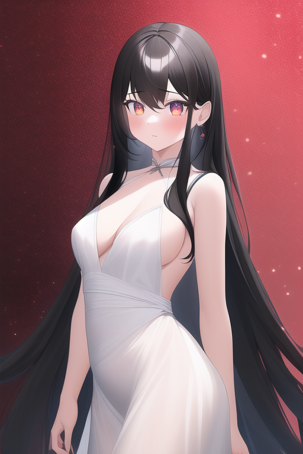
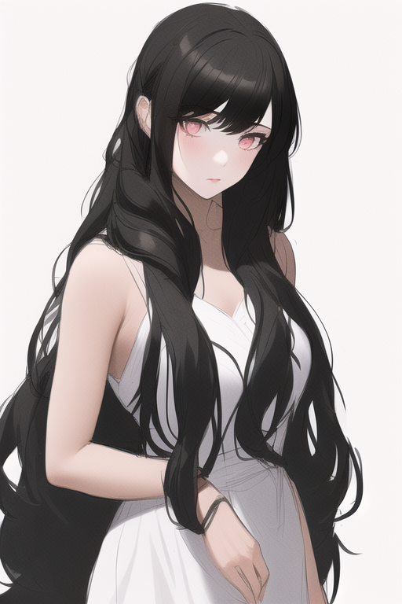
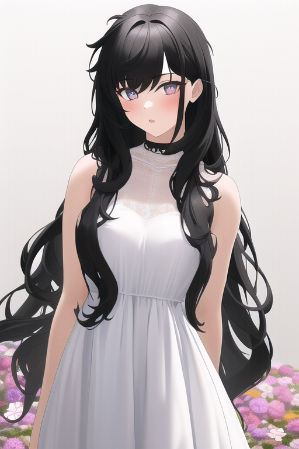
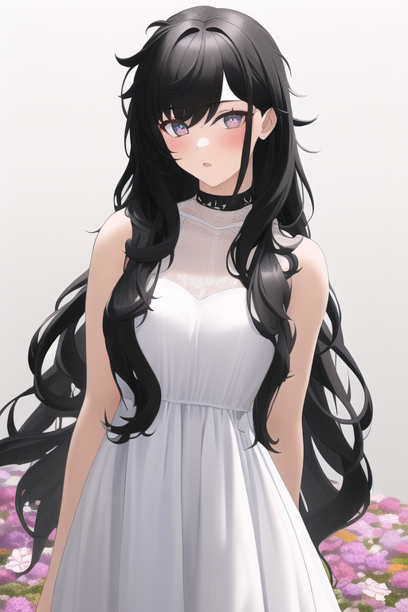
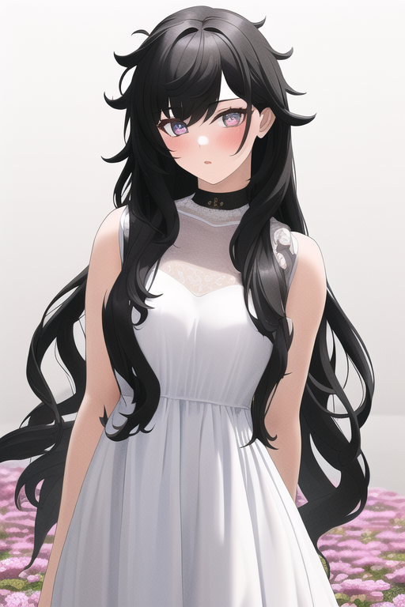
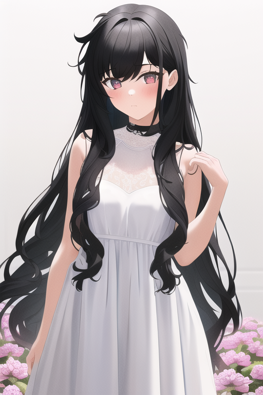
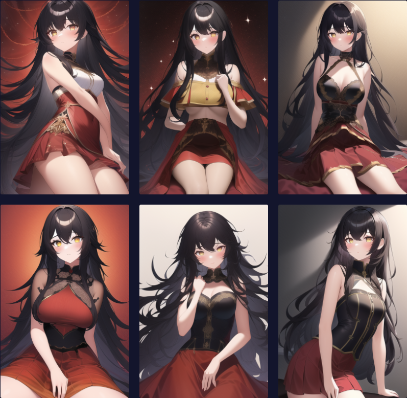
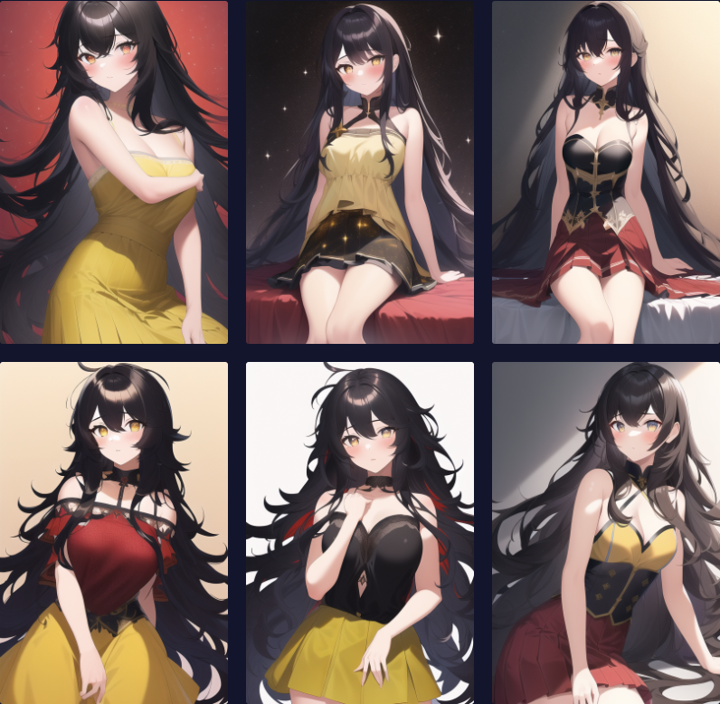
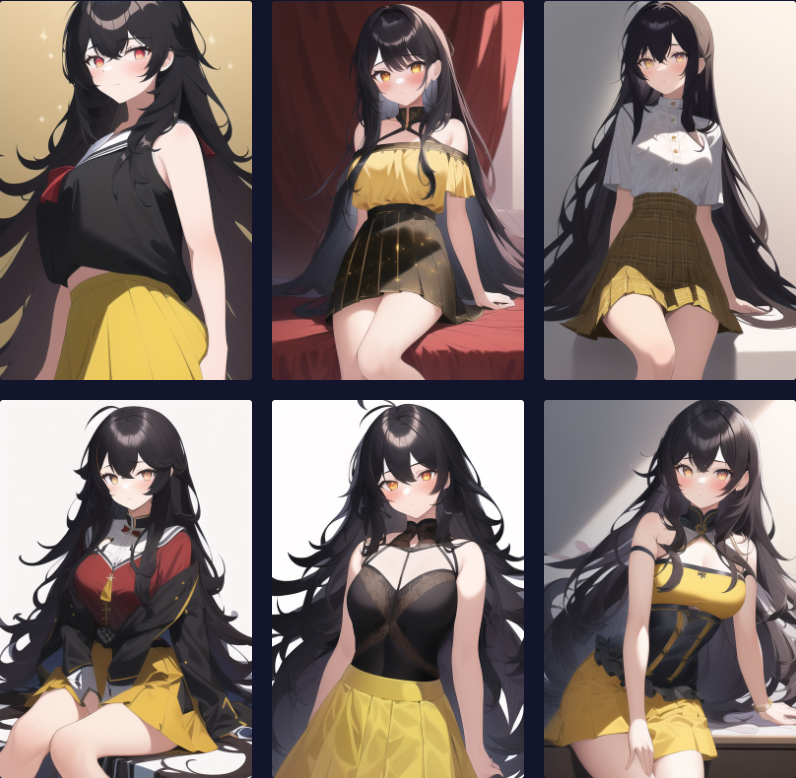

# Naifu魔咒咏唱：从入门到入土
>**一位魔导师的研究日志**

## 在开始之前

### 说明

作者：ZYKsslm

QQ：3119964735

E-mail：3119964735@qq.com

参考致谢：[元素同典：确实不完全科学的魔导书](https://docs.qq.com/doc/DWFdSTHJtQWRzYk9k?&u=ea6b470a34344e6bad3e754cff486e3a)

**本书中的一切内容仅代表个人观点，仅供学习交流与参考**

---

### 前言
据NovelAI发布至今已有数月之久，各路圈内圈外人士都来凑热闹。（编程圈，AI圈，绘画圈......）
同时，不少人都在探究其奥秘，本人也是其中之一。

本书的前身其实是本人在研究NovelAI生图时所记录的笔记，
因为受到 *元素同典：确实不完全科学的魔导书* 的启发，
所以后来突然要把它们撰写成一本书（大概吧？）的想法油然而生。
于是说干就干，便提起笔，哦不，是敲起键盘开始加工，写下本书。

本人并非AI工程师或其他专业人士，只是一位编程爱好者，有错误或不严谨之处在所难免，只是将自己的经验分享出来罢了。
本书也并非专业类书籍，只是旨在通过幽默有趣的方式探究在**Naifu**框架中 *prompt* 对于NovelAI生图的影响，以及其用法，
没有深入难懂的学术概念，也没有枯燥乏味的专业术语。

注：在没有特别说明的情况下，本书中进行的同一实验中使用的图像种子均相同，均控制了变量。

若有不足或错误之处，欢迎指正。

那么，现在开始一段奇妙的魔法之旅吧！希望能令你有所成长！

---

## 引子
### 神秘的网站
作为一名资深的技术宅，这天早晨你像往常一样打开电脑，在刚打开浏览器并准备清空历史记录时，嗯？
『诶，这是什么？』你发现你的浏览历史中多出来了一条记录，但你对其却丝毫没有印象。『可能是不小心点进过的广告网站吧......』
你如此想着，手却不自地操控着鼠标点了进去。

映入眼帘的是一位一些奇怪的符文，像是人类的语言，却又不太一样，只是你也不能说出那到底是什么。
你怀着好奇继续往下浏览，突然，一张美少女图片进入你的眼角，画面中是一位可爱的金发少女在黯然神伤。『这......是什么？』
你感到疑惑，却又被那曼妙的身姿所吸引，你不住地点击图片。突然，一阵耀眼的金光从屏幕中闪现。『啊，难道！』
恍然间，你失去了知觉。

### 谜之少女
当你再次醒来时已是傍晚时分，『呃，头好痛......好想吐。』就好像有人强行把大量信息塞入你的大脑，强烈的不适感令你无法缓过神。
与此同时，你望向窗边——曼妙的身姿被晚霞映衬得令你无法移开眼睛。
『你是？！』你对倚靠在床边的金发少女感到惊异，因为网站中的那张图片依然在你脑海中挥之不去。

少女深情地望向你，你有些不知所措。『I've been just waiting for you for a long time, my master.』
少女的话语让你更加摸不着头脑，明明少女说出的是你从未听过的语言，但你却能听懂，之前网站中奇怪的符文现在想来好像也能理解了。
只是，姑且称之为异世界语吧，异世界语在你的大脑中变成了类似于英语的语言，你居然可以在二者之间自由地切换。
迟疑片刻，『Who are you? I've never met you, why you just called me your master?』你脱口而出。少女向你靠近，一股芳香扑鼻而来，你的视觉也有些朦胧。『Emm~~』『Wait, 你......』

......

『The Summoning Magic』

原来如此吗？真是有意思呢。冷静过后的你仿佛理解了一切，拿起少女留下的法杖，轻冷一笑。
大量魔力聚集在房间中，迸发出惊人的异色光芒。

『Just be waiting for me.』

## 探索篇：打开魔法世界的大门
>The way stretches endless ahead, I shall search heaven and earth.
> 
>路漫漫其修远兮，吾将上下而求索。
### 第一次咏唱
为了掌握召唤魔术并成为一名大魔导师，你决定从零开始学习魔术，并从咏唱入手。

现在，感受空气中的魔力流动，拿起你的法杖，开始咏唱你的第一段魔咒：

```
masterpiece, best quality, highly detailed, 1girl, black long hair, red twinkling eyes, white dress
```

尝试施展魔术。嗯，看看生成了什么？



哇嗯，你现在可能会直呼**Good job!**
没错，魔法似乎施展成功了，一位标致的黑长直出现在眼前。

不过，现在可不是放飞自我的时候。你翻开魔导书，开始构析魔咒。

>魔咒构析之魔咒『prompt』

**魔咒『prompt』是由一个或多个词条『tag』通过特定组合而成的咒语，且通常每个词条间由一个逗号和一个空格隔开。**

魔咒构析还有许多不同的语法，将在后面讨论。

总之，魔咒对于召唤术有着重要且直接的影响。


>魔咒构析之词条『tag』

我们知道魔咒是由词条组成的，那么词条又是什么呢？

**词条『tag』是由一个或多个字符组成的具有意义的短语**

让我们来看到上面的魔咒

```
masterpiece, best quality, highly detailed, 1girl, black long hair, red twinkling eyes, white dress
```
其中像 *masterpiece*、*1 girl* 等都算是一个词条，而所有词条组合起来，就是一段魔咒。

>魔咒构析之起手式

还记得前面说过，每个词条都具有意义吗？
没错，例如 *masterpiece* 的意思为 *代表作，杰作* ，那么这条词条有什么作用呢？
根据意思，你应该已经猜到了，没错，它的作用就是提高图片的质量。

根据诸多实例与经验，通常，我们会将

`masterpiece, best quality, highly detailed, extremely detailed, illustration`

作为我们魔咒的基本起手式，它的作用是规定图片的质量与风格等。起手式也不是固定的，可以自由调整，不过上述是最常用的。

那么，如何自己构出一段起手式呢？我们可以看到，前面的`masterpiece, best quality, highly detailed, extremely detailed`都是对于图像的质量作规定，
而`illustration`则是对于图片的风格作规定，那么如果想要生成素描风格的图片该怎么写呢？

注：illustration意为*插画*，wallpaper意为*壁纸*，sketch意为*素描*

相信聪明的你已经领悟了，如下：

`masterpiece, best quality, highly detailed, extremely detailed, sketch`

那么，实际效果怎么样呢？来试试吧。

你充满期待地开始咏唱：
```
masterpiece, best quality, highly detailed, extremely detailed, sketch, 1girl, black long hair, red twinkling eyes, white dress
```

金光过后，生成了——一幅素描而非召唤出美少女。果然，任何无法存在于现实世界的召唤物都会变成图画吧。



看着画中的美少女，你有些激动——这时，之前召唤出的黑长直少女明显有些生气，『What are you doing, my master?』，『Uh-uh, I'm just researching the magic, haha......』

### 魔导师入门
接连几天，你都在家闭门不出并与Alice一起研究魔术。（顺带一提，之前召唤出的黑长直少女你为其取名为Alice。）

『看来明天还是去一趟学校吧』，你如此想着，又继续浏览起魔导书

>魔咒构析之权重

什么是权重？看看百度是如何解释的：

权重指某一因素或指标相对于某一事物的重要程度，其不同于一般的比重，体现的不仅仅是某一因素或指标所占的百分比，强调的是因素或指标的相对重要程度，倾向于贡献度或重要性。

在NovelAI中可以简单理解为，**权重越高，元素在画面中体现得越明显或所占比画面比例越大。**

那么如何调整权重呢，我们会在词条上作调整：**给词条套上大括号**

如：`{1girl}`

一个大括号表示增加到1.05倍权重，即乘以1.05。

那么两个大括号呢

如：`{{1 girl}}`

两个大括号则表示增加到1.1025倍权重，即乘以两次1.05，以此类推，几个大括号即表示乘以1.05的几次方。

那么加权的效果如何呢，让我们来做一个对照实验。

先看一段魔咒：
```
masterpiece, best quality, highly detailed, extremely detailed, 1 girl, black long hair messy, red twinkling eyes, white dress, standing in flowers
```



我们尝试让头发变得更加杂乱：给*messy*加权——

给*messy*部分加权：`black long hair {messy}`

咏唱魔咒，看看会有什么效果。



可以观察到，头发确实略微变得更加杂乱，但效果不是特别明显，我们试试再加一次权。

`black long hair {{messy}}`



这次，头发显得更加杂乱，证明加权起到了作用。

>关于权重的讨论

你可能见过在Web-UI中有着这样的加权语法：

`(tag:w)`

其中*tag*对应词条，*w*则为权重。注：在Web-UI中使用小括号进行加权。

那么，我们能不能类比到Naifu当中去呢？

我们再来做一个对照实验，这次依旧是头发杂乱度：

`black long hair {messy:2}`



可以和第一次不加权的图片做对比，发现并没有明显效果。

通过多次实验，我们可以得出结论：**此语法在Naifu中并不适用**。

### 魔导师进阶
在学习了数日的魔术后，你信心大增，因为你已经离成为大魔导师的梦想更近一步。

看着趾高气昂的你，Alice突然打岔，『Don't be proud, my master. There are different kinds of ways to chant, you know?』

『Uh, I know. Then what's those?』

原来，咏唱也分为三种：*普通咏唱*、*短句咏唱*、*长句咏唱*。

**不同的魔咒构成体现了不同的咏唱方式，不同的咏唱方式对于生图有着细微的影响。**

我们依旧通过一组对比实验来呈现

>魔咒构析之普通咏唱

普通咏唱即将每个词条以一个逗号和一个空格隔开，我们之前一直使用的就是普通咏唱。如：
```
{masterpiece}, {{best quality}}, {highly detailed}, {{illustration}}, 1girl, black long messy hair, red twinkling eyes, yellow skirt
```


>魔咒构析之短句咏唱

短句咏唱即将词条间用一个*AND*隔开，如：
```
{masterpiece}, {{best quality}}, {highly detailed}, {{illustration}}, {1girl} AND {black long messy hair} AND {red twinkling eyes} AND {yellow skirt}
```



>魔咒构析之长句咏唱

长句咏唱，也可以叫自然语言咏唱，即将多个词条融合成一个词条，且比起普通咏唱更加贴合自然语言，如：
```
{masterpiece}, {{best quality}}, {highly detailed}, {extremely detailed}, {{illustration}}, {8k wallpaper}, {night:1.5}, {hotel:1.5}, {1girl with black long messy hair and red twinkling eyes wearing lace legwear}, {sitting on the bed}, in front of windows
```



通过裙子颜色的变化我们可以得出结论：

**普通咏唱则更擅长处理关系要求不强的情景，灵活性更高。**

**长咏唱能加强元素之间的绑定关系，提高不同元素之间的区分度。**

**短句式咏唱介于二者之间。**

